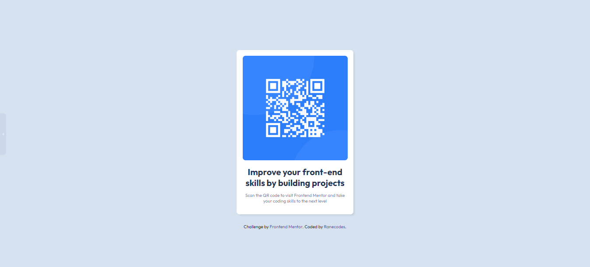

# Frontend Mentor - QR code component solution

This is a solution to the [QR code component challenge on Frontend Mentor](https://www.frontendmentor.io/challenges/qr-code-component-iux_sIO_H). Frontend Mentor challenges help you improve your coding skills by building realistic projects. 

## Table of contents

- [Overview](#overview)
  - [Screenshot](#screenshot)
  - [Links](#links)
- [My process](#my-process)
  - [Built with](#built-with)
  - [What I learned](#what-i-learned)
- [Author](#author)
- [Acknowledgments](#acknowledgments)

## Overview

### Screenshot

### Links

- Live Site URL: [https://ranecodes.github.io/]

## My process

### Built with

- Semantic HTML5 markup
- CSS custom properties
- Flexbox

### What I learned

I learned how to use the flex display option and the functions of the justify-content and align-items elements, which I normally would confuse one for the other.

## Author

- Raneh Egbe
- Frontend Mentor - [@Ranecodes](https://www.frontendmentor.io/profile/Ranecodes)
- Twitter - [@Raneh_E](https://www.twitter.com/Raneh_E)

## Acknowledgments

I will like to thank tsbsankara on Youtube, I was having a hard time until I came across his channel. He helped me understand how to navigate the css flexbox.

